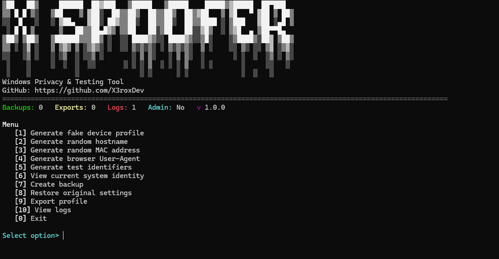

# X Privacy Spoofer

X Privacy Spoofer is a professional Windows terminal application for legitimate privacy protection, software testing, lab environments, and temporary test identities. It runs in Windows Terminal, Command Prompt, or PowerShell and provides a clean Rich-powered black-and-white console interface.

The application focuses on safe generation, preview, export, backup, and restore workflows. It does not modify protected Windows hardware identifiers and does not include bypass, evasion, firmware, driver, kernel, licensing, activation, or anti-cheat functionality.

## Safety Disclaimer

This project is intended for lawful privacy, development, QA, and lab use. Use it only on systems you own or administer. Hostname and adapter MAC testing features can affect local networking and may require a restart or adapter reconnect.

X Privacy Spoofer does not provide hardware ban bypass, anti-cheat bypass, BIOS serial modification, disk serial modification, TPM spoofing, Windows activation bypass, kernel drivers, security product bypass, or license verification bypass.

## Features

- Generate fictional Windows test device profiles.
- Generate realistic Windows-style hostnames.
- Generate locally administered unicast MAC addresses.
- Optionally apply a MAC value through supported Windows adapter advanced settings.
- Generate browser User-Agent strings for Chrome, Edge, and Firefox.
- Generate safe fictional development and QA identifiers.
- View read-only local system identity information with masking controls.
- Create timestamped backups before supported system changes.
- Restore supported hostname and adapter MAC settings from validated backups.
- Export generated data as JSON, TXT, or CSV.
- Log application events, errors, permission failures, backups, restores, and supported changes.

## Installation

```bash
git clone https://github.com/X3roxDev/x_privacy_spoofer.git
cd x_privacy_spoofer
pip install -r requirements.txt
python main.py
```

Python 3.11 or newer is recommended.

## Usage

Run the app from Windows Terminal, Command Prompt, or PowerShell:

```bash
python main.py
```

Main menu:

```text
[1] Generate fake device profile
[2] Generate random hostname
[3] Generate random MAC address
[4] Generate browser User-Agent
[5] Generate test identifiers
[6] View current system identity
[7] Create backup
[8] Restore original settings
[9] Export profile
[10] View logs
[0] Exit
```

Generated profiles, User-Agents, MAC addresses, hostnames, and identifiers can be previewed safely without changing Windows.

## Administrator Permissions

Most features work without administrator permissions. Administrator rights are required only when applying supported system changes:

- Applying a hostname with Windows `Rename-Computer`.
- Applying or restoring an adapter MAC testing value with Windows network adapter advanced properties.
- Restarting the selected adapter after an adapter MAC change.

The app checks administrator status before system-changing actions. It never silently changes settings, always asks for confirmation, and creates a backup before supported changes.

## Screenshots



## Project Structure

```text
x_privacy_spoofer/
|-- main.py
|-- config.py
|-- requirements.txt
|-- README.md
|-- LICENSE
|-- modules/
|   |-- __init__.py
|   |-- console_ui.py
|   |-- profile_generator.py
|   |-- hostname_manager.py
|   |-- mac_manager.py
|   |-- user_agent_generator.py
|   |-- identifier_generator.py
|   |-- system_info.py
|   |-- backup_manager.py
|   |-- export_manager.py
|   |-- logger.py
|   |-- admin_utils.py
```

Runtime folders `backups/`, `exports/`, and `logs/` are created automatically when the app needs them.

## Export Examples

Exports are saved in the `exports/` directory.

Example JSON:

```json
{
  "profile_name": "Windows Test Profile",
  "generated_at": "2026-07-27T18:00:00",
  "hostname": "DEV-PC-2941",
  "username": "TestUser84",
  "device_uuid": "generated-uuid",
  "test_client_id": "generated-client-id",
  "mac_address": "02:4A:8F:31:B7:C2",
  "browser_user_agent": "generated-user-agent",
  "purpose": "privacy and software testing"
}
```

Supported export formats:

- JSON
- TXT
- CSV

## Backup And Restore

Backups are saved in the `backups/` directory as timestamped JSON files. A backup is automatically created before every supported system change.

Backup records include:

- Original hostname
- Selected network adapter
- Previous adapter MAC advanced-property value
- Date and time
- Application version
- Change type
- Notes

The restore menu validates backup files before using them. Hostname backups restore the original hostname through supported Windows commands. Adapter MAC backups restore the previous adapter `NetworkAddress` advanced-property value and restart only the selected adapter.

## Logging

Logs are saved in:

```text
logs/x_privacy_spoofer.log
```

The app logs application start and exit, generated profile events, backup creation, restore attempts, supported setting changes, permission failures, and errors. It does not intentionally log passwords, authentication tokens, public IP addresses, or unnecessary sensitive data.

## Troubleshooting

Run the terminal as Administrator if a supported hostname or adapter setting change fails due to permissions.

If adapter MAC testing fails, the selected adapter or driver may not expose the `NetworkAddress` advanced property. Choose another adapter or restore from the backup menu.

If a hostname change succeeds but the visible hostname does not update immediately, restart Windows.

If Rich output does not render cleanly, use Windows Terminal or a modern PowerShell console.

## Supported Windows Versions

- Windows 10
- Windows 11

The project is designed for Python 3.11 or newer.

## Restricted Features

The following are intentionally not implemented:

- HWID ban bypass
- Game ban bypass
- Anti-cheat bypass
- BIOS serial modification
- Motherboard serial modification
- Disk serial modification
- Volume serial spoofing for evasion
- TPM spoofing
- Windows MachineGuid modification
- Windows Product ID modification
- Windows activation bypass
- Driver-based spoofing
- Kernel-level modifications
- Security product bypass
- License verification bypass
- Account restriction evasion

When a restricted feature is requested inside the app, it displays:

```text
This feature is not available because the application is designed only for legitimate privacy protection and testing.
```
